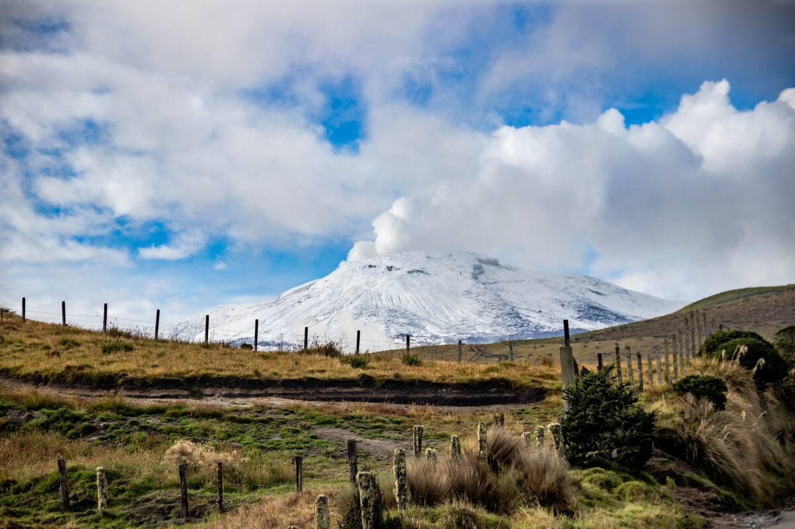

# Introduction

Volcanic environments are among the most dynamic and extreme ecosystems on Earth. Beyond the immediate threat of eruptions, volcanic systems exert continuous pressure on surrounding vegetation through fumarolic activity. These vents release a mixture of volcanic gases (such as $CO_2$, $SO_2$, and $H_2S$) and create localized soil thermal anomalies that can significantly alter plant physiology and growth patterns.

Understanding how these emissions affect "greenness" is vital for monitoring both volcanic health and ecological resilience. The Normalized Difference Vegetation Index (NDVI) serves as a reliable proxy for photosynthetic activity and canopy density. By analyzing NDVI trends in high-stress zones (near active vents) versus distal control areas, we can quantify the footprint of volcanic degassing on the landscape.



The objective of this project is to use satellite-derived vegetation indices to identify signals of stress in the mountainous ecosystems surrounding the volcano, specifically focusing on the end of 2024 – end of 2025 period.
All sites were analyzed over the same time period, so climatic and seasonal effects are shared, while differences among sites are primarily linked to spatial proximity to volcanic activity.

---


# Data and Methods

## Data source

The data for this analysis was sourced from the NASA Land Processes Distributed Active Archive Center (LP DAAC). Specifically, I used the MOD13Q1 (Version 6.1) product, which provides Vegetation Index data from the Terra MODIS (Moderate Resolution Imaging Spectroradiometer) satellite.

## Data Collection (Manual Extraction)

Instead of using automated programming interfaces (APIs), the data was extracted using the NASA AppEEARS (Application for Extracting and Exploring Analysis Ready Samples) platform. The collection process involved several steps:

Site Selection: Three specific geographic coordinates (Latitude/Longitude) were identified representing varying distances and elevations relative to the volcanic center. First point around 1/2km from the from active fumarolic influence, an intermediate of ~ 3/5km, and one >5km, with reduced volcanic impact. These distances reflect ecological exposure gradients rather than strict spatial thresholds.

Product Specification: I selected the 250-meter resolution NDVI layer, which offers a balance between spatial detail and a high temporal frequency of 16 days.

Temporal Range: Observations were pulled starting from December 2024 through December 2025 to capture a full annual cycle of vegetation awakening, maximum growth, and senescence.

Format: The raw data was exported as 3 CSV files (1 for all different specific geographic coordinates) containing NDVI values. 

## R packages

The following R packages were used:

```
ibrary(ggplot2)      # Data visualization
library(viridis)      # Colorblind-friendly color scales
library(patchwork)    # Combine plots
library(spatstat.geom) # 2D spatial analysis   
library(spatstat.explore) # exploratory spatial data analysis
```
## Data Import
```
s1 <- read.csv("C:/Users/User/Desktop/485.csv", sep=";", header=FALSE)
s2 <- read.csv("C:/Users/User/Desktop/4885.csv", sep=";", header=FALSE)
s3 <- read.csv("C:/Users/User/Desktop/4892.csv", sep=";", header=FALSE)
```
### Processing: Scale 1/10000
```
map_data <- data.frame(
  Site = c("St. 485", "St. 4885", "St. 4892"),
  lon  = c(-75.28, -75.31, -75.324),
  lat  = c(48.5, 48.85, 48.92),
  val  = c(mean(s1[,2])/10000, mean(s2[,2])/10000, mean(s3[,2])/10000)
)
```


# Spatial Analysis (Interpolation and Surface Modeling)

This section converts discrete NDVI measurements into a continuous spatial surface, allowing vegetation patterns to be visualized beyond individual sampling points. By applying Kernel Density Estimation (KDE), the analysis highlights areas where low or high NDVI values are spatially concentrated.

***KDE was used as an exploratory visualization to highlight spatial gradients in NDVI rather than to predict exact values between points. With limited sampling, it helps reveal directional patterns related to volcanic influence.***
```
win <- owin(xrange=range(map_data$lon)+c(-0.1, 0.1), yrange=range(map_data$lat)+c(-0.1, 0.1))
pts <- ppp(x=map_data$lon, y=map_data$lat, window=win, marks=map_data$val)
dens <- density(pts, sigma=0.015, weights=map_data$val)
df_dens <- as.data.frame(as.im(dens))
colnames(df_dens) <- c("lon", "lat", "z")
ax_x <- "Longitude"
ax_y <- "Latitude"
```
## Points Graph - Colorblind friendly (Viridis)
```
p1 <- ggplot(map_data, aes(x=lon, y=lat)) +
  geom_point(aes(color=val), size=10) +
  geom_text(aes(label=Site), vjust=-1.5, size=3) +
  scale_color_viridis_c(option="viridis", name="NDVI") +
  labs(title="Sampling Units (CVD Safe)", subtitle="Scale: Viridis", x=ax_x, y=ax_y) +
  theme_bw()
```
## Points Graph - Standard (Red-Green)
```
p2 <- ggplot(map_data, aes(x=lon, y=lat)) +
  geom_point(aes(color=val), size=10) +
  geom_text(aes(label=Site), vjust=-1.5, size=3) +
  scale_color_gradient(low="red", high="darkgreen", name="NDVI") +
  labs(title="Sampling Units (Standard)", subtitle="Scale: Red-Green", x=ax_x, y=ax_y) +
  theme_bw()
```
## Surface Modeling - Colorblind Friendly (Magma)
```
p3 <- ggplot(df_dens, aes(x=lon, y=lat, z=z)) +
  geom_contour_filled(bins=13) +
  scale_fill_viridis_d(option="magma", name="Density") +
  labs(title="KDE Surface (CVD Safe)", subtitle="Scale: Magma", x=ax_x, y=ax_y) +
  theme_bw()
```
## Surface Modeling - Standard (Spectral)
```
p4 <- ggplot(df_dens, aes(x=lon, y=lat, z=z)) +
  geom_contour_filled(bins=13) +
  scale_fill_brewer(palette="Spectral", name="Density") +
  labs(title="KDE Surface (Standard)", subtitle="Scale: Spectral Heatmap", x=ax_x, y=ax_y) +
  theme_bw()
```


# Final Output (2*2 grid) / Discussion

```
(p1 | p2) / (p3 | p4)
```


NDVI values vary spatially across the study area, with lower values observed at sites closer to the volcanic system and higher values at more distant locations. This pattern suggests a vegetation stress gradient consistent with chronic volcanic degassing.

The KDE surface reinforces this interpretation by showing spatial clustering of lower NDVI values near the volcano, indicating that vegetation stress extends beyond isolated points. Although the interpolation is based on a limited number of sites, the agreement between point-based observations and surface patterns supports the interpretation of volcanically driven vegetation stress.

The main limitation thus, is the small number of sampling points, which restricts the analysis to qualitative interpretation rather than quantitative spatial prediction. 

### Further exploration
In the data sets, there have been a number of measurements that were taken during unstable weather conditions. This way, the quality of their values can have a small percentage of bias, compared to the ones measured under clearer conditions. A future study focused on the difference of results considering extra the quality factors of the measurements could be interesting.


# Conclusion

This project shows how remote sensing and spatial analysis can be combined to visualize vegetation stress gradients in extreme environments using limited but meaningful data.

The approach is particularly useful in remote or hazardous areas where extensive field sampling is impractical. Using freely available MODIS data and reproducible methods, the project shows how ecological stress signals can be detected and visualized even with limited sampling points.

## Thank you for your attention!


